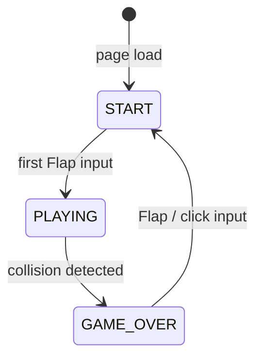

# Design Document: Flappy Kiro

## Overview

Flappy Kiro is a self-contained browser game delivered as a single HTML file. It uses the HTML5 Canvas API for rendering and vanilla JavaScript for all game logic. There are no build steps, no external libraries, and no server — the file opens directly in any modern browser.

The game follows a classic game-loop architecture: each animation frame the engine reads input state, advances physics, checks collisions, updates score, scrolls pipes and clouds, then redraws the canvas. State is modelled as an explicit finite state machine with three states: `START`, `PLAYING`, and `GAME_OVER`.

All numeric constants (pipe speed, gap size, gravity, flap impulse, canvas dimensions, etc.) are declared as named constants at the top of the script so they are easy to tune without hunting through logic code.

---

## Architecture

### Component Decomposition

The game is organised into six cooperating components, each owning a clear slice of responsibility. Because the whole game lives in one HTML file, "components" are JavaScript objects / module-like IIFE closures rather than separate files.

```
┌──────────────────────────────────────────────────────┐
│                        index.html                    │
│                                                      │
│  ┌─────────────┐   ┌──────────────┐  ┌───────────┐  │
│  │ Input       │   │  Game Loop   │  │ Renderer  │  │
│  │ Handler     │──▶│  (RAF)       │─▶│           │  │
│  └─────────────┘   └──────┬───────┘  └───────────┘  │
│                           │                          │
│              ┌────────────┼────────────┐             │
│              ▼            ▼            ▼             │
│       ┌─────────┐  ┌──────────┐  ┌──────────┐       │
│       │ Physics │  │  Pipe    │  │  Score   │       │
│       │ Engine  │  │ Manager  │  │ Manager  │       │
│       └─────────┘  └──────────┘  └──────────┘       │
│                                                      │
│       ┌─────────────────┐  ┌──────────────────┐     │
│       │ Collision       │  │  Audio Manager   │     │
│       │ Detector        │  │                  │     │
│       └─────────────────┘  └──────────────────┘     │
└──────────────────────────────────────────────────────┘
```

### State Machine



The global `gameState` variable holds one of the three string values `"START"`, `"PLAYING"`, or `"GAME_OVER"`. Each component's update and render functions branch on this value.

### Game Loop

The game loop runs via `requestAnimationFrame`. On each tick:

1. `InputHandler.flush()` — consume the pending flap flag
2. `PhysicsEngine.update()` — apply gravity, update Kiro position
3. `PipeManager.update()` — scroll pipes, recycle off-screen pairs
4. `CloudManager.update()` — scroll clouds at parallax speed
5. `CollisionDetector.check()` — test Kiro vs pipes / floor / ceiling
6. `ScoreManager.update()` — detect pipe-clear events, increment score
7. `Renderer.draw()` — clear canvas, draw background, clouds, pipes, Kiro, HUD, overlays

If `gameState !== "PLAYING"` the loop still runs (for rendering the start / game-over screens) but steps 2–6 are skipped.

---

## Components and Interfaces

### Constants

```js
const CANVAS_W = 480;
const CANVAS_H = 640;
const GRAVITY = 0.5;           // px/frame² added to vy each frame
const FLAP_VELOCITY = -9;      // px/frame (negative = upward)
const PIPE_SPEED = 3;          // px/frame (2–4 range, tunable)
const PIPE_WIDTH = 52;         // px (40–60 range)
const PIPE_CAP_EXTRA = 16;     // extra width each side for cap
const GAP_HEIGHT = 140;        // px (120–160 range)
const GAP_MIN_Y = 60;          // px from top to gap centre
const GAP_MAX_Y = CANVAS_H - 60; // px from top to gap centre
const PIPE_SPACING = 175;      // px centre-to-centre (150–200)
const CLOUD_SPEED = PIPE_SPEED * 0.5;
const HUD_HEIGHT = 36;         // px
const GHOST_W = 48;            // sprite render width
const GHOST_H = 48;            // sprite render height
const ASSET_BASE = "kiro-introduction-starter-kit/assets/";
```

### InputHandler

Listens for `keydown` (Space), `click`, and `touchstart` events on the document. Sets an internal `flapPending` boolean. The game loop reads and clears this flag via `InputHandler.consumeFlap()`.

```
InputHandler
  .consumeFlap() → boolean   // returns true once per gesture, then resets
```

### PhysicsEngine

Owns Kiro's position and velocity. All values are in canvas-space pixels.

```
PhysicsEngine
  .kiro: { x, y, vy }        // centre of sprite
  .reset()                   // y = CANVAS_H/2, vy = 0
  .flap()                    // vy = FLAP_VELOCITY
  .update()                  // vy += GRAVITY; y += vy; clamp to canvas
```

`y` is clamped so that collision detection can catch floor/ceiling independently; the physics engine does not kill the game — it just moves Kiro.

### PipeManager

Maintains an array of pipe-pair objects. Each pair has a computed top-pipe rect and bottom-pipe rect derived from its `gapCentreY`.

```
PipePair: {
  x,            // left edge of pipe (centre = x + PIPE_WIDTH/2)
  gapCentreY,   // vertical centre of the gap
  scored        // boolean: has this pair already been counted?
}
```

```
PipeManager
  .pipes: PipePair[]
  .reset()        // re-initialise two pairs off right edge
  .update()       // scroll left; recycle when x < -PIPE_WIDTH
  .getTopRect(p)  → { x, y, w, h }
  .getBottomRect(p) → { x, y, w, h }
```

Recycling: when a pipe exits the left edge, its `x` is set to the `x` of the rightmost pipe plus `PIPE_SPACING`, and a new `gapCentreY` is randomised within `[GAP_MIN_Y + GAP_HEIGHT/2, GAP_MAX_Y - GAP_HEIGHT/2]`. `scored` is reset to `false`.

### CloudManager

Maintains 3–4 cloud objects, each with `{ x, y, w, h }`. Clouds scroll left at `CLOUD_SPEED` and wrap to the right edge when they exit the left edge.

### CollisionDetector

Pure function — no state. Called each frame during `PLAYING`.

```
CollisionDetector
  .check(kiro, pipes) → boolean  // true if collision
```

Uses axis-aligned bounding box (AABB) intersection. Kiro's hitbox is inset by 4 px on each side relative to the sprite bounds to give slightly forgiving collision margins (a common Flappy Bird convention).

```
kiroHitbox = {
  x: kiro.x - GHOST_W/2 + 4,
  y: kiro.y - GHOST_H/2 + 4,
  w: GHOST_W - 8,
  h: GHOST_H - 8
}
```

Floor collision: `kiro.y + GHOST_H/2 >= CANVAS_H - HUD_HEIGHT`
Ceiling collision: `kiro.y - GHOST_H/2 <= 0`

### ScoreManager

```
ScoreManager
  .score: number
  .highScore: number
  .reset()          // score = 0; highScore preserved
  .update(pipes, kiro)  // checks pipe-clear; increments if needed
  .saveHighScore()  // writes to localStorage
  .loadHighScore()  // reads from localStorage; defaults to 0
```

Pipe-clear detection: for each pipe pair where `!p.scored` and `kiro.x > p.x + PIPE_WIDTH`, set `p.scored = true` and call `increment()`.

### AudioManager

Loads `jump.wav` and `game_over.wav` via the `Audio` constructor. The jump sound restarts on each flap by resetting `currentTime = 0` before calling `play()`. A `userInteracted` flag is set on the first flap to handle autoplay restrictions.

```
AudioManager
  .init()       // create Audio objects; attach error handlers (silent)
  .playJump()   // jump.currentTime = 0; jump.play().catch(()=>{})
  .playGameOver() // gameOver.play().catch(()=>{})
```

### Renderer

Responsible for all canvas drawing. Called every frame regardless of game state.

```
Renderer
  .draw(state, kiro, pipes, clouds, score, highScore)
```

Draw order each frame:
1. Background fill (`#a8d8ea`)
2. Clouds (white filled ellipses)
3. Pipes (filled green rects + darker green cap rects)
4. Kiro sprite (rotated based on `vy`)
5. HUD bar (semi-transparent dark rect + text)
6. Overlay text (start prompt, game-over message)

**Sprite rotation mapping:**
- `vy <= FLAP_VELOCITY` → `−30°` (−π/6 radians)
- `vy === 0` → `0°`
- `vy >= MAX_FALL_VEL` → `+90°` (+π/2 radians)

`MAX_FALL_VEL` is defined as the terminal velocity (gravity * 30, capped at ~15 px/frame). Linear interpolation between these anchor points:

```
angle = lerp(vy, FLAP_VELOCITY, MAX_FALL_VEL, -Math.PI/6, Math.PI/2)
angle = clamp(angle, -Math.PI/6, Math.PI/2)
```

Rotation is applied with `ctx.save() / ctx.translate(cx, cy) / ctx.rotate(angle) / ctx.drawImage(...) / ctx.restore()`.

---

## Data Models

### Game State

```
type GameState = "START" | "PLAYING" | "GAME_OVER"
```

### Kiro

```js
{
  x: number,     // horizontal centre, fixed at CANVAS_W * 0.25
  y: number,     // vertical centre, mutable
  vy: number     // vertical velocity (negative = up)
}
```

Kiro's `x` position is constant during gameplay. Only `y` and `vy` change.

### PipePair

```js
{
  x: number,           // left edge of pipe column
  gapCentreY: number,  // y of gap centre
  scored: boolean      // true once Kiro has cleared this pair
}
```

Derived rects (computed on read, not stored):

```
topPipeRect    = { x: p.x, y: 0, w: PIPE_WIDTH, h: p.gapCentreY - GAP_HEIGHT/2 }
bottomPipeRect = { x: p.x, y: p.gapCentreY + GAP_HEIGHT/2, w: PIPE_WIDTH, h: CANVAS_H - (p.gapCentreY + GAP_HEIGHT/2) }
```

### Cloud

```js
{
  x: number,   // left edge
  y: number,   // top edge
  w: number,   // width (randomised 60–120 px)
  h: number    // height (randomised 20–40 px)
}
```

### Score Record (localStorage)

Key: `"flappyKiro_highScore"`
Value: string representation of a non-negative integer.

```js
localStorage.setItem("flappyKiro_highScore", String(highScore));
const raw = localStorage.getItem("flappyKiro_highScore");
const val = parseInt(raw, 10);
highScore = (Number.isInteger(val) && val >= 0) ? val : 0;
```

### Rect (shared utility type)

```js
{ x: number, y: number, w: number, h: number }
```

Used by CollisionDetector and PipeManager.

---

## Correctness Properties

*A property is a characteristic or behavior that should hold true across all valid executions of a system — essentially, a formal statement about what the system should do. Properties serve as the bridge between human-readable specifications and machine-verifiable correctness guarantees.*

### Property 1: Gravity accumulates downward velocity across frames

*For any* initial vertical velocity `vy` and any number of frames `n ≥ 1` elapsed without a flap, after applying the physics update `n` times the resulting velocity SHALL equal `vy + GRAVITY * n`, and Kiro's `y` position SHALL reflect the cumulative displacement.

**Validates: Requirements 2.5**

### Property 2: Flap always resets velocity to the fixed upward impulse

*For any* pre-flap vertical velocity (regardless of its current value), calling `PhysicsEngine.flap()` SHALL set `vy` to exactly `FLAP_VELOCITY` — a fixed negative constant identical for every flap event.

**Validates: Requirements 2.4**

### Property 3: Recycled pipe gap always satisfies position and spacing invariants

*For any* recycled pipe pair, its `gapCentreY` SHALL satisfy `GAP_MIN_Y + GAP_HEIGHT/2 ≤ gapCentreY ≤ CANVAS_H − GAP_MIN_Y − GAP_HEIGHT/2`, ensuring the gap centre is never closer than 60 px to either canvas edge. Additionally, for any two consecutive pipe pairs after recycling, the horizontal centre-to-centre distance SHALL lie within `[150, 200]` px.

**Validates: Requirements 3.2, 3.3, 3.4**

### Property 4: Pipe scrolling is constant and uniform

*For any* set of pipe positions and any number of frames `n ∈ [1, 200]` before any pipe reaches the recycle threshold, each pipe's `x` SHALL decrease by exactly `PIPE_SPEED * n` after `n` update calls.

**Validates: Requirements 3.1**

### Property 5: Cloud parallax scrolling is always half of pipe speed

*For any* cloud `x` position and any number of frames `n ≥ 1` (before the cloud wraps), the cloud's `x` SHALL decrease by exactly `PIPE_SPEED * 0.5 * n` after `n` update calls — always half the pipe scroll speed.

**Validates: Requirements 7.2**

### Property 6: Score increments exactly once per pipe pair cleared

*For any* pipe pair where `scored === false` and `kiro.x > p.x + PIPE_WIDTH`, after one call to `ScoreManager.update()` the score SHALL have increased by exactly 1 and `p.scored` SHALL be `true`. *For any* subsequent update call on the same pair (`scored === true`), the score SHALL not increment again.

**Validates: Requirements 5.1**

### Property 7: High score equals the maximum score across all sessions

*For any* sequence of completed game sessions with scores `s₁, s₂, …, sₙ`, the stored high score after all sessions SHALL equal `max(s₁, s₂, …, sₙ)` — it never decreases between sessions.

**Validates: Requirements 5.3, 5.4**

### Property 8: High score localStorage round-trip with invalid-value fallback

*For any* non-negative integer high score value written via `ScoreManager.saveHighScore()`, reading it back via `ScoreManager.loadHighScore()` SHALL return the identical integer. *For any* invalid stored value (null, missing key, NaN, negative number, non-integer string, or floating-point string), `loadHighScore()` SHALL return `0`.

**Validates: Requirements 5.4, 5.5, 5.6**

### Property 9: Score reset always zeroes score while preserving high score

*For any* `(score, highScore)` state before a game reset, calling `ScoreManager.reset()` SHALL set `score` to `0` while leaving `highScore` unchanged.

**Validates: Requirements 5.7, 8.5**

### Property 10: Sprite rotation is bounded and monotonically non-decreasing with velocity

*For any* vertical velocity `vy ∈ [FLAP_VELOCITY, MAX_FALL_VEL]`, the computed rotation angle SHALL lie within `[−π/6, +π/2]` radians (−30° to +90°), and SHALL be monotonically non-decreasing as `vy` increases — a higher downward velocity always maps to an equal or greater rotation angle.

**Validates: Requirements 7.4**

### Property 11: AABB collision is accurate for pipes, floor, and ceiling

*For any* Kiro hitbox and pipe rect that genuinely overlap (sharing interior area), `CollisionDetector.check()` SHALL return `true`; *for any* pair that do not overlap (gap between edges ≥ 1 px), it SHALL return `false`. Additionally, *for any* Kiro `y` position where the bottom edge reaches or exceeds the floor boundary, or the top edge reaches or goes above the ceiling, `CollisionDetector.check()` SHALL return `true`.

**Validates: Requirements 4.1, 4.2, 4.3**

---

## Error Handling

### Browser Compatibility

Before starting the game loop, check for Canvas support:

```js
if (!canvas.getContext) {
  document.body.innerHTML = "<p>Your browser does not support HTML5 Canvas. Please use a modern browser.</p>";
}
```

### Audio Autoplay

`Audio.play()` returns a Promise. All `play()` calls are wrapped:

```js
audio.play().catch(() => { /* silent */ });
```

The `AudioManager` sets a `userInteracted` flag on the first flap, unblocking audio from that point on.

### Audio Asset Load Failures

`Audio` objects attach an `onerror` handler that sets an internal `failed` flag. `playJump()` and `playGameOver()` check the flag and no-op silently if set. Gameplay continues normally with no audio for that asset.

### Invalid localStorage High Score

On load, `parseInt` is used with explicit radix 10. If the result is `NaN`, negative, or not a finite integer, `highScore` defaults to `0`.

### Canvas Sizing / Scaling

CSS scales the canvas using `object-fit: contain` (or equivalent `max-width`/`max-height` rules) so it fits the viewport without scrollbars. The canvas logical resolution stays fixed at 480 × 640 — only the CSS display size changes.

---

## Testing Strategy

### Unit Tests

Unit tests cover the pure-logic components using a standard JS test runner (Jest or Vitest). No DOM or Canvas API is needed for most tests — the physics engine, pipe manager, score manager, and collision detector are pure functions operating on plain objects.

Focus areas:
- `PhysicsEngine`: gravity accumulation, flap impulse, boundary clamping
- `PipeManager`: pipe recycling (gap bounds, spacing), initial layout
- `CollisionDetector`: AABB overlap and non-overlap cases, floor/ceiling boundaries
- `ScoreManager`: increment, reset, high-score update logic, localStorage round-trip, invalid-value fallback

### Property-Based Tests

Property-based testing is appropriate here because the core engine components are pure functions with well-defined input/output behaviour and universal invariants that hold across the full numeric input space.

**Library**: [fast-check](https://github.com/dubzzz/fast-check) (TypeScript/JavaScript PBT library)
**Minimum iterations**: 100 per property

Each property test is tagged with a comment referencing the design property:

```js
// Feature: flappy-kiro, Property 1: Gravity increases downward velocity each frame
```

Properties to implement as tests:

| Property | Test description |
|---|---|
| 1 | Generate random `vy ∈ [-15, 15]` and `n ∈ [1, 60]`; run `n` physics updates without flap; assert `vy_final === vy_initial + GRAVITY * n` |
| 2 | Generate random `vy ∈ [-20, 20]`; call `flap()`; assert `vy === FLAP_VELOCITY` exactly |
| 3 | Generate 100+ recycle events with random canvas heights; assert every `gapCentreY` satisfies gap-bounds invariant AND consecutive pipe spacing is in `[150, 200]` px |
| 4 | Generate random initial pipe positions and `n ∈ [1, 200]` (below recycle threshold); assert each `x` decreased by exactly `PIPE_SPEED * n` |
| 5 | Generate random `x ∈ [-100, 600]` and `n ∈ [1, 100]`; run `n` cloud updates; assert `x` decreased by `PIPE_SPEED * 0.5 * n` |
| 6 | Generate random pipe pairs with `scored = false`, position Kiro past right edge; run one update; assert score incremented by 1 and `scored === true`; run second update; assert score unchanged |
| 7 | Generate random sequences of scores (1–50 sessions); assert stored high score equals `Math.max(...scores)` |
| 8 | Generate random non-negative integers; `saveHighScore()` then `loadHighScore()`; assert round-trip identity. Also generate invalid values (null, NaN, negative, float, empty string); assert `loadHighScore()` returns `0` |
| 9 | Generate random `(score, highScore)` pairs; call `reset()`; assert `score === 0` and `highScore` unchanged |
| 10 | Generate random `vy ∈ [FLAP_VELOCITY, MAX_FALL_VEL]`; compute rotation angle; assert ∈ `[−π/6, +π/2]` and monotone with respect to `vy` ordering (sort two random velocities, verify angles are in same order) |
| 11 | Generate overlapping rect pairs (Kiro vs pipe); assert `check()` returns `true`. Generate non-overlapping pairs; assert `false`. Generate Kiro y positions at/beyond floor and ceiling; assert `true` |

### Integration / Example Tests

Because rendering and audio involve the browser DOM, they are tested with example-based integration tests (or manual verification):

- Start state renders start prompt (visual check)
- Game-over state renders "Game Over" overlay (visual check)
- HUD reflects correct score after pipe clear (example test with mock canvas context)
- Audio `playJump()` does not throw when called rapidly in succession
- `localStorage` high score persists across simulated page reloads

### Manual Smoke Tests

- Open `index.html` in Chrome, Firefox, and Safari; verify game loads without errors
- Verify canvas scales correctly on mobile viewport
- Verify sound plays on first flap and on game over
- Verify high score persists after page refresh
